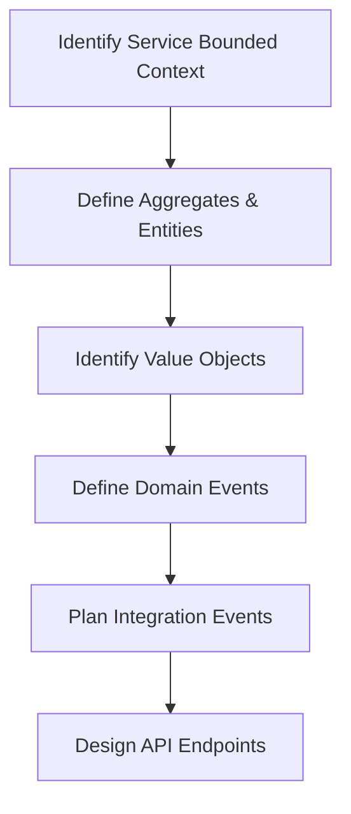
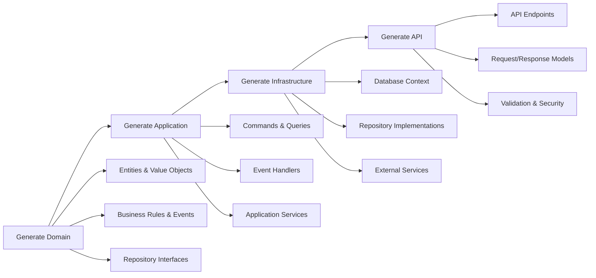
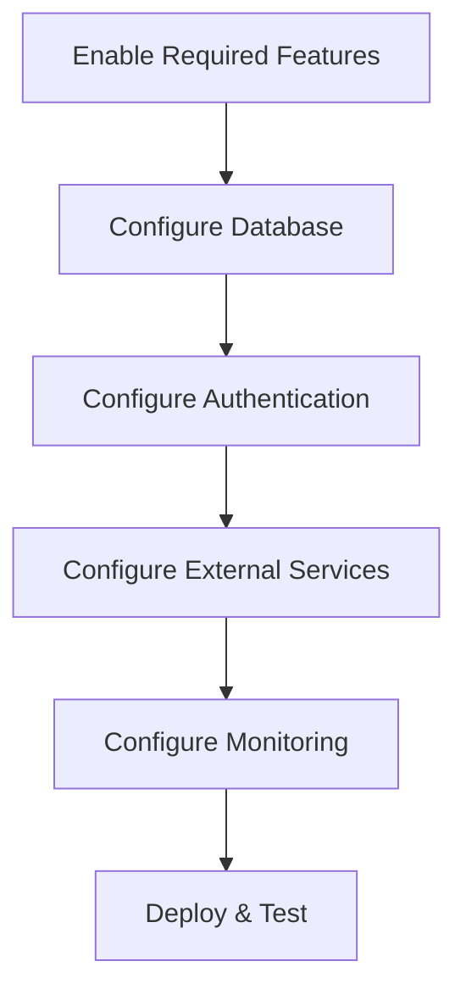

# Service Layer Generation System

## Overview
This folder contains comprehensive prompts for generating complete microservices that leverage the BuildingBlocks architecture. The service generation system provides a systematic approach to creating production-ready microservices with minimal configuration and maximum consistency.

## Service Generation Prompts

### 1. [Domain Service Prompt](01-Domain-Service-Prompt.md)
**Purpose**: Generate the Domain layer for a microservice
- **Dependencies**: BuildingBlocks.Domain (automatic)
- **Key Features**:
  - Strongly-typed IDs with JSON serialization
  - Immutable value objects with validation
  - Rich aggregate roots with business methods
  - Domain events for business workflows
  - Business rules for invariant enforcement
  - Specifications for query logic
  - Repository interfaces for data access
  - Domain services for complex logic

### 2. [Application Service Prompt](02-Application-Service-Prompt.md)
**Purpose**: Generate the Application layer for a microservice
- **Dependencies**: BuildingBlocks.Application + Service Domain (automatic)
- **Key Features**:
  - CQRS implementation with commands and queries
  - Custom mediator with pipeline behaviors
  - Event handling for domain and integration events
  - Application services for workflow orchestration
  - DTOs for data transfer
  - Mapping between domain and DTOs
  - Caching strategies and invalidation
  - Validation with FluentValidation

### 3. [Infrastructure Service Prompt](03-Infrastructure-Service-Prompt.md)
**Purpose**: Generate the Infrastructure layer for a microservice
- **Dependencies**: BuildingBlocks.Infrastructure + Service Application (automatic)
- **Key Features**:
  - EF Core database context with configurations
  - Repository implementations with specifications
  - Caching with multiple providers (Memory, Redis)
  - Authentication services (JWT, API Key, OAuth)
  - External service integrations with resilience
  - Background services and job processing
  - Health checks for all dependencies
  - Feature-based package inclusion

### 4. [API Service Prompt](04-API-Service-Prompt.md)
**Purpose**: Generate the API layer for a microservice
- **Dependencies**: BuildingBlocks.API + Service Infrastructure (automatic)
- **Key Features**:
  - Minimal APIs with maximum performance
  - CRUD endpoints using BuildingBlocks patterns
  - Feature-based endpoint organization
  - Comprehensive request/response validation
  - OpenAPI documentation with examples
  - Security with authentication and authorization
  - Monitoring and observability
  - Custom middleware and filters

## Service Architecture

```
┌─────────────────────────────────────────────────────────────┐
│                    YourService.API                          │
│  ┌─────────────────┐  ┌─────────────────┐  ┌──────────────┐ │
│  │   Endpoints     │  │   Middleware    │  │  Security    │ │
│  │  - CRUD APIs    │  │  - Validation   │  │  - JWT Auth  │ │
│  │  - Custom APIs  │  │  - Logging      │  │  - API Keys  │ │
│  │  - Health       │  │  - CORS         │  │  - Rate Limit│ │
│  └─────────────────┘  └─────────────────┘  └──────────────┘ │
└─────────────────────────────────────────────────────────────┘
                              │
                              ▼
┌─────────────────────────────────────────────────────────────┐
│                YourService.Infrastructure                   │
│  ┌─────────────────┐  ┌─────────────────┐  ┌──────────────┐ │
│  │   Data Layer    │  │   External      │  │  Background  │ │
│  │  - EF Context   │  │  - HTTP Clients │  │  - Jobs      │ │
│  │  - Repositories │  │  - Email        │  │  - Outbox    │ │
│  │  - UnitOfWork   │  │  - Storage      │  │  - Events    │ │
│  └─────────────────┘  └─────────────────┘  └──────────────┘ │
└─────────────────────────────────────────────────────────────┘
                              │
                              ▼
┌─────────────────────────────────────────────────────────────┐
│                 YourService.Application                     │
│  ┌─────────────────┐  ┌─────────────────┐  ┌──────────────┐ │
│  │      CQRS       │  │   App Services  │  │   Events     │ │
│  │  - Commands     │  │  - Orchestration│  │  - Handlers  │ │
│  │  - Queries      │  │  - Workflows    │  │  - Mapping   │ │
│  │  - Handlers     │  │  - Validation   │  │  - Caching   │ │
│  └─────────────────┘  └─────────────────┘  └──────────────┘ │
└─────────────────────────────────────────────────────────────┘
                              │
                              ▼
┌─────────────────────────────────────────────────────────────┐
│                   YourService.Domain                        │
│  ┌─────────────────┐  ┌─────────────────┐  ┌──────────────┐ │
│  │   Aggregates    │  │  Value Objects  │  │ Business     │ │
│  │  - Entities     │  │  - Immutable    │  │ - Rules      │ │
│  │  - Strong IDs   │  │  - Validated    │  │ - Events     │ │
│  │  - Events       │  │  - Serializable │  │ - Services   │ │
│  └─────────────────┘  └─────────────────┘  └──────────────┘ │
└─────────────────────────────────────────────────────────────┘
                              │
                              ▼
┌─────────────────────────────────────────────────────────────┐
│                      BuildingBlocks                         │
│  ┌─────────────────┐  ┌─────────────────┐  ┌──────────────┐ │
│  │     Domain      │  │  Application    │  │Infrastructure│ │
│  │  - Base Classes │  │  - CQRS         │  │  - Data      │ │
│  │  - Patterns     │  │  - Mediator     │  │  - Caching   │ │
│  │  - Abstractions │  │  - Behaviors    │  │  - Messaging │ │
│  └─────────────────┘  └─────────────────┘  └──────────────┘ │
└─────────────────────────────────────────────────────────────┘
```

## Service Generation Workflow

### 1. Planning Phase


### 2. Generation Phase


### 3. Configuration Phase


## Feature Flag System

Each service layer supports feature flags to include only required functionality:

### Domain Layer
```xml
<PropertyGroup>
  <IncludeDomainHelpers>true</IncludeDomainHelpers>  <!-- Guard clauses, functional extensions -->
</PropertyGroup>
```

### Application Layer
```xml
<PropertyGroup>
  <IncludeValidation>true</IncludeValidation>        <!-- FluentValidation -->
  <IncludeMediatR>true</IncludeMediatR>              <!-- External MediatR (optional) -->
  <IncludeMonitoring>true</IncludeMonitoring>        <!-- OpenTelemetry, Health Checks -->
  <IncludeMessaging>true</IncludeMessaging>          <!-- Message bus abstractions -->
</PropertyGroup>
```

### Infrastructure Layer
```xml
<PropertyGroup>
  <!-- Core Infrastructure -->
  <IncludeEntityFramework>true</IncludeEntityFramework>
  <IncludeCaching>true</IncludeCaching>
  
  <!-- External Services -->
  <IncludeAuthentication>true</IncludeAuthentication>
  <IncludeMessaging>true</IncludeMessaging>
  <IncludeEmailServices>true</IncludeEmailServices>
  <IncludeHttpClient>true</IncludeHttpClient>
  <IncludeCloudStorage>true</IncludeCloudStorage>
  
  <!-- Monitoring & Background -->
  <IncludeMonitoring>true</IncludeMonitoring>
  <IncludeBackgroundServices>true</IncludeBackgroundServices>
</PropertyGroup>
```

### API Layer
```xml
<PropertyGroup>
  <!-- API Features -->
  <IncludeSwagger>true</IncludeSwagger>
  <IncludeApiVersioning>true</IncludeApiVersioning>
  <IncludeValidation>true</IncludeValidation>
  
  <!-- Security & Monitoring -->
  <IncludeAuthentication>true</IncludeAuthentication>
  <IncludeRateLimiting>true</IncludeRateLimiting>
  <IncludeHealthChecks>true</IncludeHealthChecks>
  <IncludeMonitoring>true</IncludeMonitoring>
</PropertyGroup>
```

## Complete Service Example

### AuthService Project Structure
```
AuthService/
├── AuthService.Domain/
│   ├── AuthService.Domain.csproj        # <Project Sdk="Microsoft.NET.Sdk"/>
│   ├── Aggregates/
│   │   ├── User/
│   │   │   ├── User.cs                  # User aggregate root
│   │   │   ├── UserId.cs                # Strongly-typed ID
│   │   │   ├── UserDomainEvents.cs      # Domain events
│   │   │   ├── UserSpecifications.cs    # Query specifications
│   │   │   └── UserBusinessRules.cs     # Business rules
│   │   └── Role/
│   │       ├── Role.cs
│   │       ├── RoleId.cs
│   │       └── RoleDomainEvents.cs
│   ├── ValueObjects/
│   │   ├── Username.cs                  # Username value object
│   │   ├── Email.cs                     # Email value object
│   │   ├── PasswordHash.cs              # Password hash value object
│   │   └── UserStatus.cs                # User status enumeration
│   ├── Repositories/
│   │   ├── IUserRepository.cs           # User repository interface
│   │   └── IRoleRepository.cs           # Role repository interface
│   ├── Events/
│   │   ├── AuthIntegrationEvents.cs     # Integration events
│   │   └── ExternalIntegrationEvents.cs # External events
│   └── Extensions/
│       └── ServiceCollectionExtensions.cs
├── AuthService.Application/
│   ├── AuthService.Application.csproj   # <Project Sdk="Microsoft.NET.Sdk"/>
│   ├── Commands/
│   │   ├── User/
│   │   │   ├── CreateUser/
│   │   │   │   ├── CreateUserCommand.cs
│   │   │   │   ├── CreateUserCommandHandler.cs
│   │   │   │   └── CreateUserCommandValidator.cs
│   │   │   └── UpdateUser/
│   │   │       ├── UpdateUserCommand.cs
│   │   │       ├── UpdateUserCommandHandler.cs
│   │   │       └── UpdateUserCommandValidator.cs
│   │   └── Authentication/
│   │       ├── Login/
│   │       │   ├── LoginCommand.cs
│   │       │   ├── LoginCommandHandler.cs
│   │       │   └── LoginCommandValidator.cs
│   │       └── Register/
│   │           ├── RegisterCommand.cs
│   │           ├── RegisterCommandHandler.cs
│   │           └── RegisterCommandValidator.cs
│   ├── Queries/
│   │   ├── User/
│   │   │   ├── GetUserById/
│   │   │   │   ├── GetUserByIdQuery.cs
│   │   │   │   └── GetUserByIdQueryHandler.cs
│   │   │   └── SearchUsers/
│   │   │       ├── SearchUsersQuery.cs
│   │   │       └── SearchUsersQueryHandler.cs
│   │   └── Authentication/
│   │       ├── ValidateCredentials/
│   │       │   ├── ValidateCredentialsQuery.cs
│   │       │   └── ValidateCredentialsQueryHandler.cs
│   │       └── GetUserRoles/
│   │           ├── GetUserRolesQuery.cs
│   │           └── GetUserRolesQueryHandler.cs
│   ├── Events/
│   │   ├── DomainEventHandlers/
│   │   │   └── UserDomainEventHandlers.cs
│   │   └── IntegrationEventHandlers/
│   │       └── ExternalEventHandlers.cs
│   ├── DTOs/
│   │   ├── User/
│   │   │   ├── UserDto.cs
│   │   │   ├── CreateUserRequest.cs
│   │   │   └── UpdateUserRequest.cs
│   │   └── Authentication/
│   │       ├── LoginRequest.cs
│   │       ├── LoginResponse.cs
│   │       └── RegisterRequest.cs
│   ├── Services/
│   │   ├── IAuthApplicationService.cs
│   │   └── AuthApplicationService.cs
│   ├── Mapping/
│   │   └── UserMappingProfile.cs
│   ├── Caching/
│   │   └── AuthCacheKeys.cs
│   └── Extensions/
│       └── ServiceCollectionExtensions.cs
├── AuthService.Infrastructure/
│   ├── AuthService.Infrastructure.csproj # <Project Sdk="Microsoft.NET.Sdk"/>
│   ├── Data/
│   │   ├── Context/
│   │   │   ├── AuthDbContext.cs
│   │   │   └── DesignTimeDbContextFactory.cs
│   │   ├── Configurations/
│   │   │   ├── UserConfiguration.cs
│   │   │   └── RoleConfiguration.cs
│   │   ├── Repositories/
│   │   │   ├── UserRepository.cs
│   │   │   ├── RoleRepository.cs
│   │   │   └── UnitOfWork.cs
│   │   └── Migrations/
│   ├── Authentication/
│   │   ├── JwtTokenService.cs
│   │   └── PasswordHashingService.cs
│   ├── Caching/
│   │   └── AuthCacheService.cs
│   ├── Health/
│   │   └── AuthHealthChecks.cs
│   └── Extensions/
│       └── ServiceCollectionExtensions.cs
└── AuthService.API/
    ├── AuthService.API.csproj            # <Project Sdk="Microsoft.NET.Sdk.Web"/>
    ├── Program.cs                        # Application entry point
    ├── Endpoints/
    │   ├── Authentication/
    │   │   └── AuthenticationEndpoints.cs
    │   ├── Users/
    │   │   └── UserEndpoints.cs
    │   └── Common/
    │       └── HealthEndpoints.cs
    ├── Models/
    │   ├── Requests/
    │   │   ├── Authentication/
    │   │   │   ├── LoginRequest.cs
    │   │   │   └── RegisterRequest.cs
    │   │   └── Users/
    │   │       ├── CreateUserRequest.cs
    │   │       └── UpdateUserRequest.cs
    │   ├── Responses/
    │   │   ├── Authentication/
    │   │   │   └── LoginResponse.cs
    │   │   └── Users/
    │   │       └── UserResponse.cs
    │   └── Validators/
    │       ├── AuthenticationValidators.cs
    │       └── UserValidators.cs
    ├── Middleware/
    │   ├── AuthExceptionMiddleware.cs
    │   └── CorrelationIdMiddleware.cs
    ├── Configuration/
    │   └── SwaggerConfiguration.cs
    └── Extensions/
        ├── ServiceCollectionExtensions.cs
        └── WebApplicationExtensions.cs
```

## Quick Start Guide

### 1. Generate Domain Layer
```bash
# Use Domain Service Prompt (01-Domain-Service-Prompt.md)
# Generate: Entities, Value Objects, Events, Business Rules, Specifications
```

### 2. Generate Application Layer
```bash
# Use Application Service Prompt (02-Application-Service-Prompt.md)
# Generate: Commands, Queries, Handlers, DTOs, Services, Event Handlers
```

### 3. Generate Infrastructure Layer
```bash
# Use Infrastructure Service Prompt (03-Infrastructure-Service-Prompt.md)
# Generate: Database Context, Repositories, External Services, Background Jobs
```

### 4. Generate API Layer
```bash
# Use API Service Prompt (04-API-Service-Prompt.md)
# Generate: Endpoints, Models, Validation, Security, Documentation
```

### 5. Configure and Run
```bash
# Build the complete service
dotnet build

# Run database migrations
dotnet ef database update --project AuthService.Infrastructure --startup-project AuthService.API

# Run the service
dotnet run --project AuthService.API
```

## Benefits of This Approach

### 1. **Zero Configuration**
- **Simplified .csproj files** - just the SDK reference
- **Automatic package management** via centralized build system
- **Automatic project references** following Clean Architecture
- **Feature flags** control what's included

### 2. **Production Ready**
- **Security** built-in with authentication, authorization, rate limiting
- **Monitoring** with health checks, metrics, distributed tracing
- **Resilience** with retry policies, circuit breakers, timeouts
- **Performance** with caching, async patterns, minimal APIs

### 3. **Developer Experience**
- **Consistent patterns** across all services
- **Type safety** with strongly-typed IDs and validation
- **Auto-generated documentation** with OpenAPI/Swagger
- **Easy testing** with clear separation of concerns

### 4. **Enterprise Scale**
- **Event-driven architecture** with domain and integration events
- **CQRS** for scalable read/write separation
- **Background processing** for reliable operations
- **Multi-tenancy** support built-in

### 5. **Maintainable Code**
- **Clean Architecture** boundaries enforced
- **Domain-Driven Design** patterns throughout
- **Comprehensive validation** at all boundaries
- **Structured logging** with correlation IDs

Use these prompts to generate complete, production-ready microservices that follow best practices and integrate seamlessly with the BuildingBlocks architecture! 